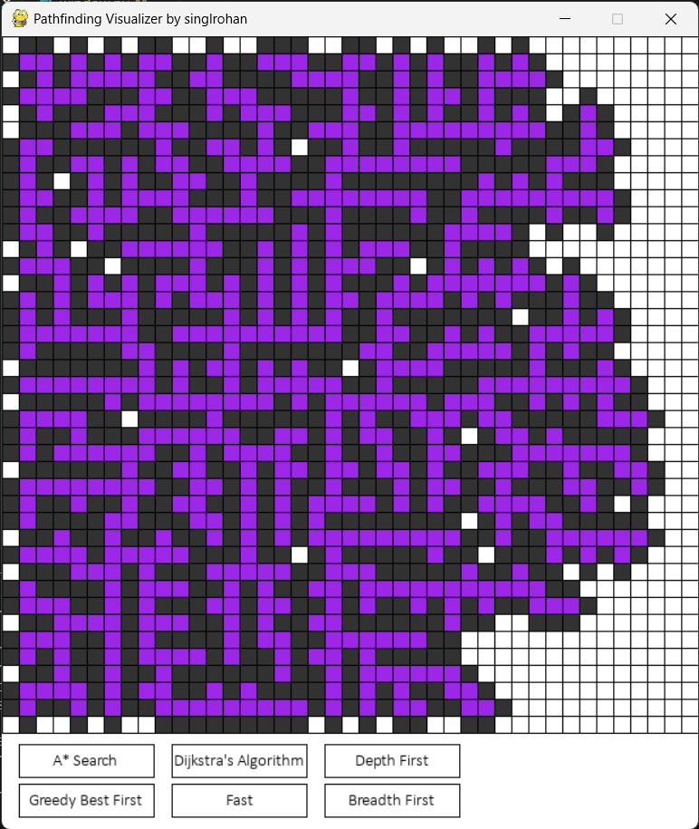
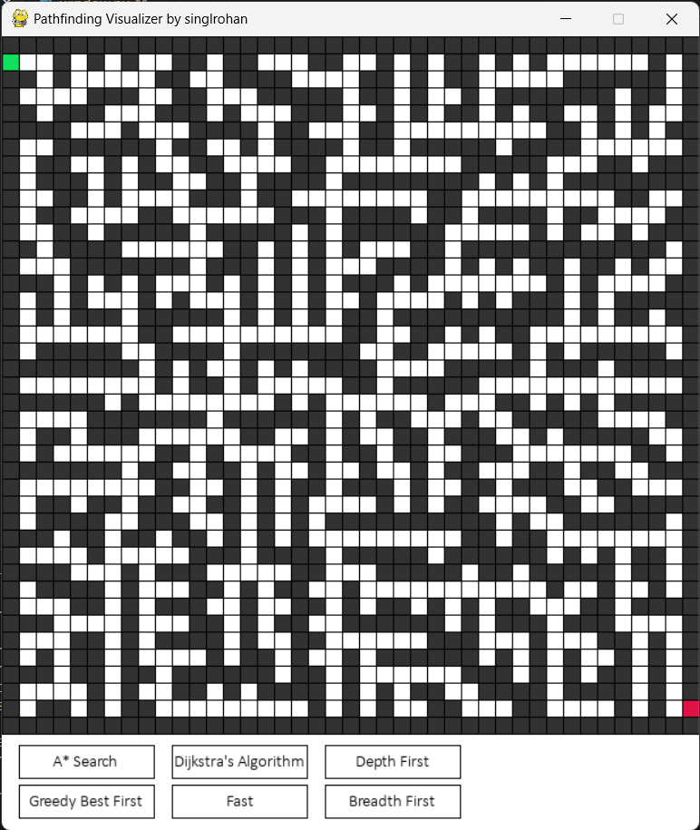
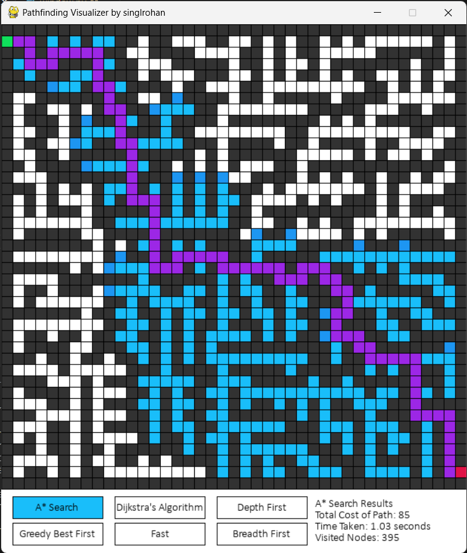

# Pathfinding Visualizer by singlarohan

A visual pathfinding program that allows the user to create their own obstacles or mazes and then run different pathfinding algorithms on it. This program includes the ability to place weighted path nodes, the ability to generate a random maze using Prim's algorithm, a results display after each successful path found, and five different algorithms to choose from.

## Demo Images

Maze Generating

Maze Generated

Path using A* Search

## Features
- **Five Unique Pathfinding Algorithms:**
  - A* Search
  - Dijkstra's Algorithm
  - Greedy Best First Search
  - Breadth First Search
  - Depth First Search
  
- **Built-in Maze Generator Algorithm:** Prim's Algorithm
- **Real-time Visualization:** Observe algorithms in action.
- **Custom Maze Creation:** Design mazes and obstacles, including weighted nodes.
- **Results Display:** Information shown after successful pathfinding:
  - Algorithm name
  - Total cost of the solution
  - Time taken
  - Number of visited nodes
- **Adjustable Speed:** Change algorithm speed before/during execution.
- **Pause and Resume:** Temporarily halt and resume algorithm execution.

## Controls
- **Left-click** to place nodes:
  - First click sets Start Node (Green)
  - Second click sets End Node (Red)
  - Subsequent clicks place walls or weights
  - Press **"w" + Left-click** for weighted nodes (cost = 9; normal nodes cost 1)
  - Drag while clicking to place multiple nodes

- **Algorithm Selection and Speed Control:**
  - Left-click an algorithm to select it
  - Click on speed button (options: Slow, Medium, Fast)

- **Right-click** to reset nodes:
  - Right-click on a node resets it
  - Drag while right-clicking to reset multiple nodes

- **Key Shortcuts:**
  - **"c" key:** Reset the board
  - **"g" key:** Generate a random maze using Prim's algorithm
  - **"p" key:** Pause/unpause an ongoing algorithm
  - **Spacebar:** Start pathfinding search after algorithm selection

## Requirements and Installation
Make sure you have Python version 3.x or higher installed.

**Required Modules**
* To install, simply enter these commands into your terminal. (for macOS users, replace pip with pip3)
* For help with installing pip: visit https://pip.pypa.io/en/stable/installing/
* pip install pygame
  * If the command above does not work, visit https://www.pygame.org/wiki/GettingStarted for help.

**Running**
* You can start the program by running visualizer.py!

# Extra Information 
Note that Pygame's graphics are going to be different depending on the machine / version of machine that you are using. I coded this on a windows machine so things look good for me, but on Mac for example text may be off center and things might look blurry or pixelated.

Also, keep in mind that since this program is taking time to draw every node that it creates and looks at, the algorithms will naturally run a little bit slower than usual, especially for the maze generating algorithm.
  * To make the algorithms run at normal speed, go to the files and remove the lines in the algorithm where it calls "draw()".
    * Ex. To speed up the maze generator algorithm, open prims.py, go to lines #95 and #190 and comment out the draw() calls.
